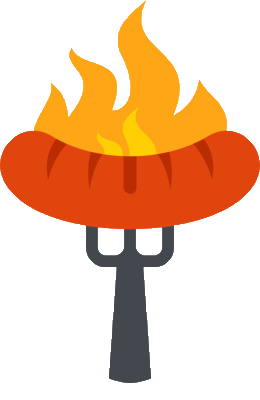
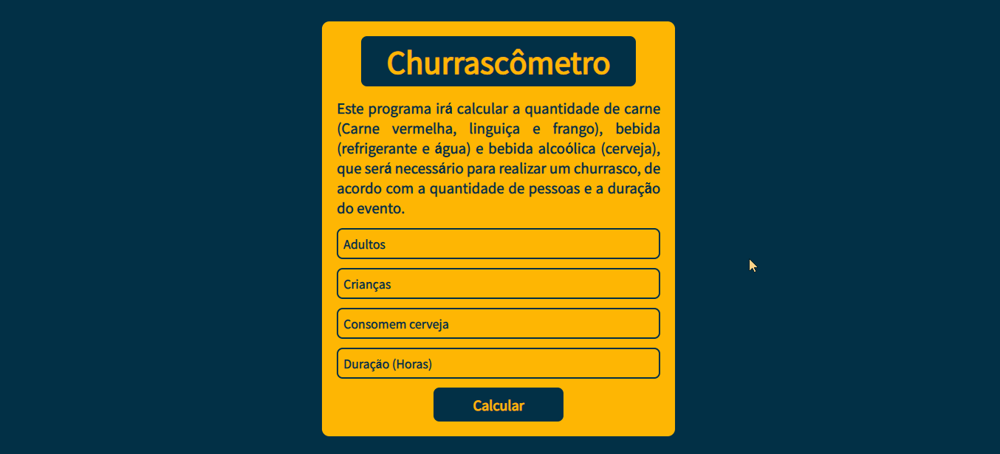
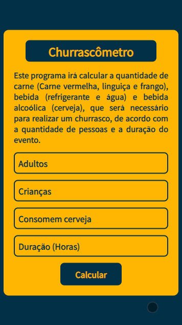

<h1 align="center"><strong>CHURRASCÔMETRO</strong>  </h1>

<h2><strong>Status:</strong> Finished ✔️</h2>

### The Churrascômetro is a barbecue manager. With it you'll be able to organize your barbecue in a simple and fast way, just fill in the fields and the program will show the amount of food and drinks for your barbecue.

 

     
          
    

 

## **🚀 Technologies:**

 

 ✅ HTML

 ✅ CSS

 ✅ JAVASCRIPT

 

## 💻 Click on [Churrascômetro](https://programa-churrascometro.netlify.app/), and make your barbecue! 🍖

 

### Thanks for reading so far. if you want to contact me, feel free to send me a message or send a connection request on my [linkedIn](https://www.linkedin.com/in/mateus-silva-folego260601/) ❤!

 

<h2 align="center"> 📖 Always remember you`re <strong>NEVER</strong> alone!
